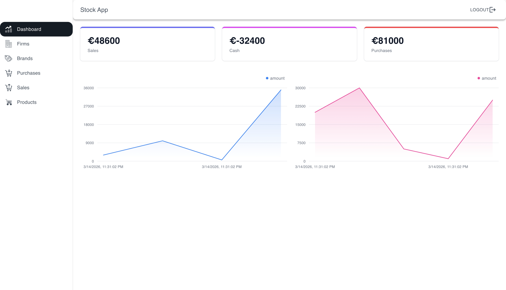

# 📈 Stock Management System (MERN Stack)

A comprehensive, full-stack Stock Management System built with the MERN stack (MongoDB, Express.js, React, Node.js). This application is designed for businesses to manage inventory, track transactions, and monitor real-time performance through interactive dashboards.

## 🔗 Live Demo
**Frontend:** [https://stockapp-mern.netlify.app/](https://stockapp-mern.netlify.app/)  
**Backend API:** [https://stockappmern-backend.onrender.com/](https://stockappmern-backend.onrender.com/)

---

### 🔑 Test Credentials
You can use the following admin account to explore all features of the application:
- **Username:** `test1`
- **Password:** `aA123456$`

---

## 📸 Screenshots

| Dashboard Overview | Firms Management |
| :---: | :---: |
|  |  |

---

##  Features

- **Authentication & Authorization:** Secure JWT-based login and registration. Role-based access control (Admin, Staff, User).
- **Interactive Dashboard:** Real-time data visualization using **Tremor** area charts and KPI metric cards.
- **Inventory Tracking:** Full CRUD operations for Products, Categories, Brands, and Firms.
- **Transactions:** Record and monitor Purchases and Sales instantly.
- **Advanced Data Tables:** Feature-rich data tables powered by **MUI X-Data-Grid** for sorting, filtering, and pagination.
- **Form Management & Validation:** Robust and user-friendly forms utilizing **Formik** and **Yup**.
- **State Management:** Global state handled by **Redux Toolkit** and persisted locally using **Redux Persist**.
- **API Documentation:** Auto-generated interactive API docs using **Swagger UI**.

##  Tech Stack

### Frontend (Client)
- **Framework:** React 18 (Vite)
- **Styling:** Material-UI (MUI), Tailwind CSS
- **Charts:** Tremor
- **State Management:** Redux Toolkit, Redux-Persist
- **Form Handling:** Formik, Yup
- **Routing:** React Router DOM
- **HTTP Client:** Axios
- **Notifications:** React Toastify

### Backend (Server)
- **Runtime:** Node.js
- **Framework:** Express.js
- **Database:** MongoDB & Mongoose
- **Authentication:** JSON Web Tokens (JWT)
- **API Documentation:** Swagger Autogen, Swagger UI Express
- **Utilities:** Multer (File uploads), Nodemailer (Emails), Morgan (Logging), CORS

## 📂 Folder Structure

```text
📦 stock-management-system
┣ 📂 client                 # Frontend Application
┃ ┣ 📂 public               # Static assets and icons
┃ ┣ 📂 src
┃ ┃ ┣ 📂 app              # Redux store configuration
┃ ┃ ┣ 📂 components       # Reusable UI components (Modals, Tables, Cards, Forms)
┃ ┃ ┣ 📂 features         # Redux slices (authSlice, stockSlice)
┃ ┃ ┣ 📂 helper           # Helper functions (e.g., ToastNotify)
┃ ┃ ┣ 📂 hook             # Custom hooks (useAuthCall, useStockCall, useAxios)
┃ ┃ ┣ 📂 pages            # Application views (Dashboard, Products, Sales, etc.)
┃ ┃ ┣ 📂 router           # AppRouter and PrivateRouter definitions
┃ ┃ ┣ 📂 styles           # Global styles and theme configurations
┃ ┃ ┗ 📜 main.jsx         # React entry point
┃ ┣ 📜 .env               # Client environment variables
┃ ┣ 📜 tailwind.config.js # Tailwind CSS configuration
┃ ┣ 📜 vite.config.js     # Vite configuration
┃ ┗ 📜 package.json       # Frontend dependencies
┣ 📂 server                 # Backend Application
┃ ┣ 📂 src
┃ ┃ ┣ 📂 configs          # Database and Swagger configurations
┃ ┃ ┣ 📂 controllers      # Route logic (auth, brands, products, etc.)
┃ ┃ ┣ 📂 helpers          # Utility functions (sync data, encrypt passwords)
┃ ┃ ┣ 📂 middlewares      # Auth checks, error handling, logging, upload
┃ ┃ ┣ 📂 models           # Mongoose database schemas
┃ ┃ ┗ 📂 routes           # Express API route definitions
┃ ┣ 📜 .env               # Server environment variables
┃ ┣ 📜 index.js           # Express server entry point
┃ ┣ 📜 swaggerAutogen.js  # Auto-generates swagger.json
┃ ┗ 📜 package.json       # Backend dependencies
┗ 📜 README.md              # Root documentation
```

## 💻 Getting Started

### Prerequisites
- Node.js (v18 or higher recommended)
- MongoDB (Local installation or MongoDB Atlas URI)

### 1. Clone the repo:**
   ```bash
   git clone [https://github.com/recep-demir/StockAppMERN.git](https://github.com/recep-demir/StockAppMERN.git)
   ```

### 2. Backend Setup
Navigate to the server directory and install dependencies:
```bash
cd server
npm install
```

Create a `.env` file in the `server` directory using `.env-sample` as a reference:
```env
PORT=8000
MONGODB=mongodb://127.0.0.1:27017/stockAPI
SECRET_KEY=your_secret_key
ACCESS_KEY=your_access_key
REFRESH_KEY=your_refresh_key
```

Start the backend server in development mode (This will also auto-generate the Swagger docs):
```bash
npm run dev
```
*The backend API will be running at http://127.0.0.1:8000*

### 3. Frontend Setup
Open a new terminal tab, navigate to the client directory, and install dependencies:
```bash
cd client
npm install
```

Create a `.env` file in the `client` directory to connect with the backend API:
```env
VITE_BASE_URL=[http://127.0.0.1:8000/](http://127.0.0.1:8000/)
```

Start the frontend development server:
```bash
npm run dev
```
*The application will open in your browser, typically at http://localhost:5173*

## 📚 API Documentation

Access interactive API docs while the server is running:
- **Swagger:** `https://stockappmern-backend.onrender.com/documents/swagger`
- **ReDoc:** `https://stockappmern-backend.onrender.com/documents/redoc`

---


## 👨‍💻 Author
**Recep Demir** [LinkedIn](https://www.linkedin.com/in/recep-demir/) | [GitHub](https://github.com/recep-demir)